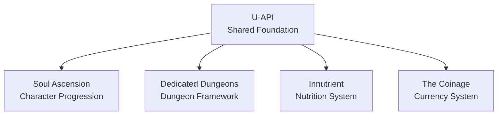

# TRACER / ENGINEERED SYSTEMS

Software architecture, game systems and product experiments.

---

## 01 / GAME SYSTEMS

### UNDERWORLD STUDIO

A modular Minecraft ecosystem built around a shared technical foundation.

### U-API

Shared infrastructure for UI, networking, diagnostics, lifecycle management and cross-mod services.

[Repository](https://github.com/tracerxbrhd/u-api)

<table>
<tr>
<td width="50%" valign="top">

<h3>Soul Ascension</h3>

Configurable RPG character progression with attributes, titles and native mod integrations.

<a href="https://github.com/tracerxbrhd/soul-ascension">Repository</a>

</td>
<td width="50%" valign="top">

<h3>Dedicated Dungeons</h3>

Framework for isolated procedural dungeon runs, encounters, loot and datapack-authored content.

<a href="https://github.com/tracerxbrhd/dedicated-dungeons">Repository</a>

</td>
</tr>
<tr>
<td width="50%" valign="top">

<h3>Innutrient</h3>

Nutrition and diet system focused on food variety, meal quality and configurable nutrient groups.

<a href="https://github.com/tracerxbrhd/innutrient">Repository</a>

</td>
<td width="50%" valign="top">

<h3>The Coinage</h3>

Physical copper, silver and gold currency with trading, loot, archaeology and integration APIs.

<a href="https://github.com/tracerxbrhd/the-coinage">Repository</a>

</td>
</tr>
</table>

---

## 02 / WEB & PRODUCT SYSTEMS

### PRFIO

A collection of product-focused web projects exploring application architecture, interfaces, data visualization and interaction design.

### TableFlow

**Restaurant operations and reservation system**

A full-stack application combining a public restaurant experience with a staff workspace for reservations, guests, tables and menu management.

`React` · `Flask` · `PostgreSQL` · `Docker`

[Repository](https://github.com/tracerxbrhd/prfio-tableflow)

<table>
<tr>
<td width="50%" valign="top">

<h3>Atlas Lab</h3>

<strong>Interactive urban data explorer</strong>

Data visualization interface for exploring mobility, sustainability, cost, green space and digital infrastructure across city scenarios.

<code>React</code> · <code>Vite</code> · <code>SVG</code> · <code>Playwright</code>

<a href="https://github.com/tracerxbrhd/prfio-atlas-lab">Repository</a>

</td>
<td width="50%" valign="top">

<h3>Verde Escape</h3>

<strong>Hospitality frontend and stay planner</strong>

Editorial retreat experience with cabin profiles, interactive media and a booking-style planner with explicit date and capacity rules.

<code>JavaScript</code> · <code>Vite</code> · <code>Playwright</code>

<a href="https://github.com/tracerxbrhd/prfio-verde-escape">Repository</a>

</td>
</tr>
</table>

### More Projects

<table>
<tr>
<td width="33%" valign="top">

<h4>OpsBoard</h4>

Delivery workspace for projects, tasks, ownership, deadlines, capacity and reporting.

<code>React</code> · <code>Django</code> · <code>PostgreSQL</code>

<a href="https://github.com/tracerxbrhd/prfio-opsboard">Repository</a>

</td>
<td width="33%" valign="top">

<h4>GlassDesk</h4>

Customer-support workspace built around ticket lifecycle, conversations, assignment and operational reporting.

<code>React</code> · <code>Django REST</code> · <code>PostgreSQL</code>

<a href="https://github.com/tracerxbrhd/prfio-glassdesk">Repository</a>

</td>
<td width="33%" valign="top">

<h4>NOVA Studio</h4>

Editorial design-studio frontend with interactive case studies, project filtering and a local brief builder.

<code>JavaScript</code> · <code>Vite</code> · <code>Playwright</code>

<a href="https://github.com/tracerxbrhd/prfio-nova-studio">Repository</a>

</td>
</tr>
</table>

---

## 03 / INDEPENDENT SYSTEMS

### Tickets! Please

**Discord support and ticket management system**

A production-oriented Discord bot for structured support workflows, persistent server configuration and ticket administration.

Built, deployed and operated as a live Discord bot.

`Python` · `Discord` · `PostgreSQL` · `Docker`

Private ticket channels · Persistent configuration · Role-based support · Audit events · EN/RU

[Repository](https://github.com/tracerxbrhd/tickets-please-discord)

---

### Platforms

GitHub · Modrinth · CurseForge
